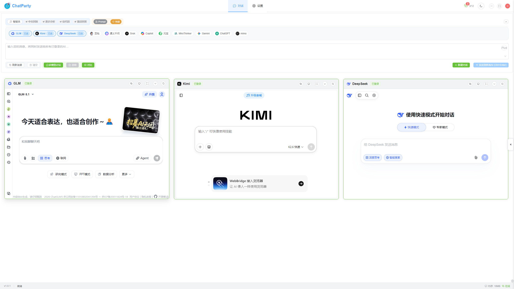
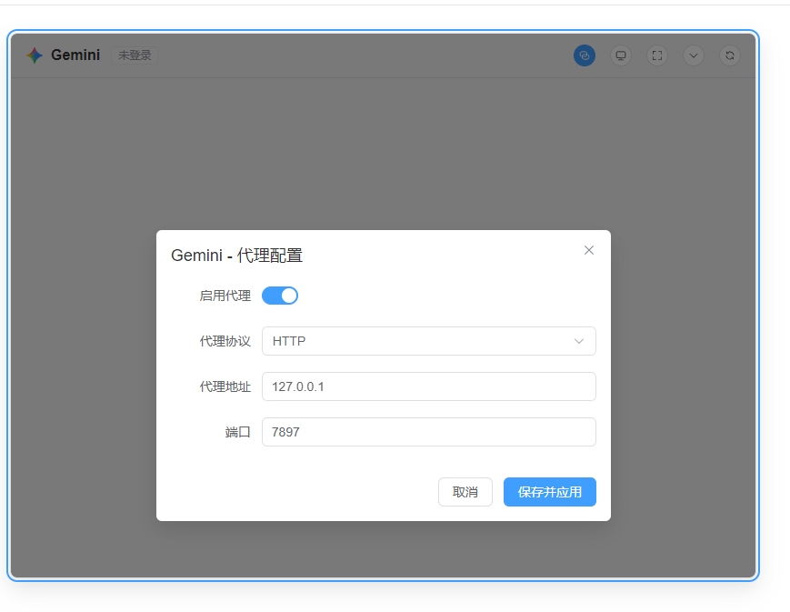
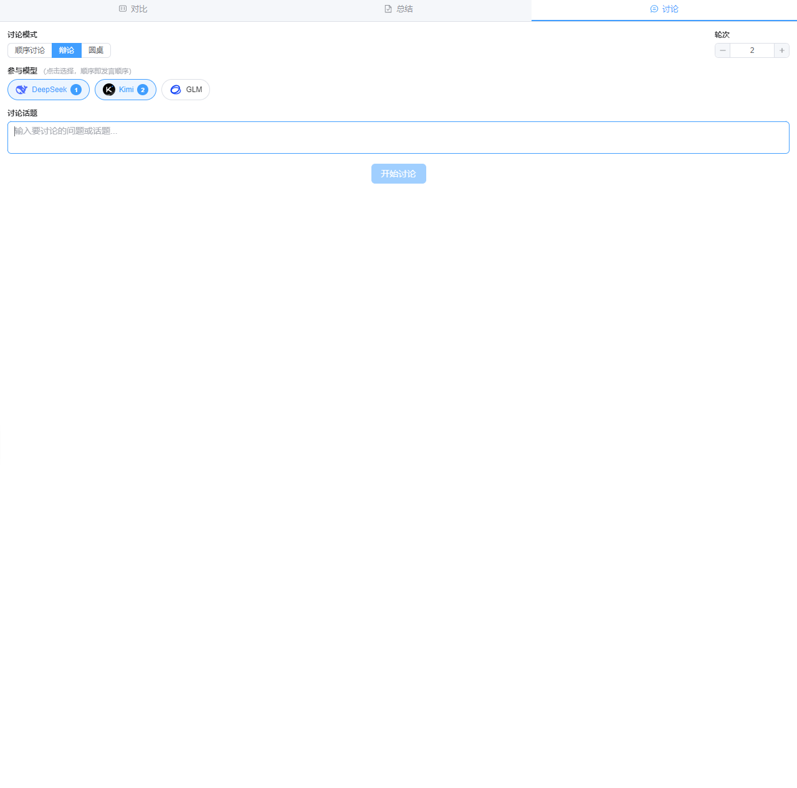

# 多AI模型统一对话平台

## 项目概述

一个基于 Electron + Vue3 + TypeScript 构建的桌面应用程序，让用户可以在单一界面同时与多个 AI 模型对话，实现高效的多模型对比和协作。支持 DeepSeek、豆包、通义千问、Kimi、Grok、Copilot、GLM、元宝、ChatGPT、Gemini、Mimo 等主流 AI 模型。

### 主界面预览



## 核心功能

### 1. 多AI模型并行对话
- **统一输入**：单一输入框，一次输入即可发送到所有选中的 AI 模型
- **并行响应**：所有 AI 模型同时处理用户输入，实时返回结果
- **直观对比**：并排显示不同 AI 的回答，便于质量对比和分析

### 2. 多模型讨论
- **顺序讨论**：多个 AI 模型按顺序依次回答，后一个模型可以基于前一个模型的回答进行补充和讨论
- **讨论面板**：侧边栏实时展示讨论过程和结论
- **内容操作**：支持复制讨论内容、跳转到对应模型对话

### 3. 多模型回答对比
- **卡片视图**：以卡片形式并排展示各模型的回答
- **表格视图**：以表格形式对比各模型回答的关键差异
- **差异视图**：高亮展示各模型回答之间的差异点

### 4. AI回答总结
- **智能总结**：选择特定 AI 模型对其他模型的回答进行总结
- **侧边栏展示**：总结结果在侧边栏中展示，不占用主对话区域

### 5. 智能体与技能系统
- **Agent 智能体**：选择不同的智能体角色，发送消息时自动拼接角色前缀
- **Skill 技能**：预设技能模板，快速应用常用提示词模式

### 6. 智能会话管理
- **自动登录保持**：首次登录后自动保存会话状态，无需重复登录
- **会话持久化**：应用重启后自动恢复所有对话历史
- **状态监控**：实时显示每个 AI 模型的连接状态和回答状态

### 7. 灵活布局系统
- **响应式网格**：根据窗口大小自动调整卡片布局
- **拖拽排序**：支持模型选择器的拖拽排序
- **最大化/最小化**：单个卡片支持全屏和最小化操作
- **多列布局**：可配置 1-6 列布局，适应不同屏幕尺寸

### 8. 工具集
- 通过环境变量 `VITE_ENABLE_TOOLSET` 控制是否构建工具集菜单页面
- 内置 ima、下载狗、smallpdf、MinerU、ai-bot、今日热榜、coze、modelscope 等工具

### 9. 个性化配置
- **主题切换**：支持浅色、深色和跟随系统主题
- **自定义脚本**：为每个 AI 提供商自定义 JavaScript 脚本（消息提取、登录检查、发送消息等）
- **代理配置**：为每个 AI 模型单独配置网络代理



- **Prompt 管理**：支持自定义 Prompt 的创建、编辑、分类和快捷应用

## 支持的AI模型

| 模型 | 提供商 | 网址 |
|------|--------|------|
| DeepSeek | 深度求索 | chat.deepseek.com |
| 豆包 | 字节跳动 | doubao.com |
| 通义千问 | 阿里云 | qianwen.com |
| Kimi | 月之暗面 | kimi.com |
| Grok | xAI | grok.com |
| Copilot | 微软 | copilot.microsoft.com |
| GLM | 智谱AI | chatglm.cn |
| 元宝 | 腾讯 | yuanbao.tencent.com |
| MiroThinker | MiroMind | miromind.ai |
| Gemini | Google | gemini.google.com |
| ChatGPT | OpenAI | chatgpt.com |
| Mimo | 小米 | aistudio.xiaomimimo.com |

## 快速开始

### 安装与启动

```bash
# 克隆项目
git clone https://github.com/chenjinyong66/ChatParty.git

# 安装依赖
npm install

# 启动开发模式（默认打开控制台，原生菜单栏）
npm run dev

# 启动生产模式（自定义菜单栏）
npm run prod

# 构建应用
npm run build

# 构建 Windows 版本
npm run build:win

# 构建 macOS 版本
npm run build:mac
```


macOS 安装后需执行：
```sh
sudo xattr -d com.apple.quarantine /Applications/ChatAllAI.app
```

### 首次使用

1. **选择 AI 模型**：在输入区域勾选需要使用的 AI 模型
2. **登录账号**：首次使用需要登录各个 AI 网站账号
3. **开始对话**：在统一输入框中输入问题，按 Ctrl+Enter 发送

## 界面布局

### 输入区域
输入区域从上到下分为三部分：
- **智能体/技能行**：Agent 选择器、Skill 栏、Prompt 管理（蓝色底=智能体区，橙色底=提示词区）
- **模型选择器**：以芯片样式展示可选模型，支持拖拽排序
- **操作按钮行**：工具按钮（灰色底）、分析按钮（绿色底：讨论/总结/对比）、新建对话、发送

### 侧边栏
- **总结**：AI 回答的总结内容
- **讨论**：多模型讨论的过程和结论
- **对比**：多模型回答的对比视图

### 卡片操作
每个 AI 卡片包含以下功能：
- 连接状态显示
- 代理设置（支持 HTTP/HTTPS/SOCKS5）
- 开发者工具
- 最大化/最小化
- 刷新

## 技术架构

### 核心技术栈

| 层级 | 技术 |
|------|------|
| 前端框架 | Vue3 + Composition API + TypeScript |
| 状态管理 | Pinia |
| UI 组件 | Element Plus |
| 桌面框架 | Electron |
| 构建工具 | Vite + Electron Builder |

### 核心模块


```
src/
├── components/
│   ├── chat/           # 聊天相关组件
│   │   ├── UnifiedInput.vue      # 统一输入区（模型选择+输入框+按钮）
│   │   ├── AICard.vue            # AI 模型卡片
│   │   ├── AgentSelector.vue     # 智能体选择器
│   │   ├── SkillBar.vue          # 技能栏
│   │   ├── PromptManager.vue     # Prompt 管理器
│   │   ├── DiscussionPanel.vue   # 多模型讨论面板
│   │   └── ComparisonPanel.vue   # 多模型对比面板
│   ├── layout/         # 布局组件
│   ├── summary/        # 总结侧边栏
│   ├── webview/        # WebView 组件
│   └── toolset/        # 工具集组件
├── services/
│   ├── MessageDispatcher.ts      # 消息分发器
│   ├── DiscussionService.ts      # 多模型讨论服务
│   └── SummaryService.ts         # 总结服务
├── stores/
│   ├── chat.ts         # 聊天状态（含 AI 提供商配置）
│   ├── agent.ts        # 智能体状态
│   ├── discussion.ts   # 讨论状态
│   ├── summary.ts      # 总结状态
│   ├── scriptConfig.ts # 自定义脚本配置
│   └── toolset.ts      # 工具集配置
├── utils/
│   ├── GetLLMLastMessage.ts      # AI 回答提取脚本
│   ├── MessageScripts.ts         # 消息发送脚本
│   ├── LoginCheckScripts.ts      # 登录检查脚本
│   ├── NewChatScripts.ts         # 新建对话脚本
│   └── StatusMonitorScripts.ts   # 状态监控脚本
└── types/              # 类型定义

electron/
├── main.ts             # 主进程入口
├── preload.ts          # 预加载脚本
└── managers/
    └── IPCHandler.ts   # IPC 通信处理
```

### 关键设计

#### 消息分发机制
消息分发器（MessageDispatcher）负责将用户输入同时发送到所有选中的 AI 模型，通过 WebView 的 `executeJavaScript` 注入脚本实现。

#### 多模型讨论机制
DiscussionService 实现模型间的顺序讨论：
1. 按选定顺序依次向每个模型发送消息
2. 通过 StatusMonitorScripts 监控每个模型的回答状态
3. 收集回答后转发给下一个模型继续讨论

#### AI 回答提取
GetLLMLastMessage.ts 为每个 AI 提供商提供定制的 DOM 提取脚本，将 HTML 内容转为 Markdown 格式。采用多选择器降级策略，适配网站 DOM 结构变化。

## 新增AI模型接入指南

### 接入步骤

1. **添加模型配置**：在 `src/stores/chat.ts` 的 providers 数组中添加配置
2. **实现登录检查脚本**：在 `src/utils/LoginCheckScripts.ts` 中添加
3. **实现消息发送脚本**：在 `src/utils/MessageScripts.ts` 中添加
4. **实现回答提取脚本**：在 `src/utils/GetLLMLastMessage.ts` 中添加
5. **实现新建对话脚本**：在 `src/utils/NewChatScripts.ts` 中添加
6. **实现状态监控脚本**：在 `src/utils/StatusMonitorScripts.ts` 中添加
7. **添加图标资源**：在 `public/icons/` 目录下添加图标文件


## 常见问题

### 登录问题
- 某个 AI 模型无法保持登录状态：检查网络连接，尝试重新登录，或配置代理

### 消息发送失败
- 消息发送后某个 AI 没有响应：检查该 AI 网站是否正常访问，WebView 是否加载完成

### 对比/总结无法收集回答
- 某个模型的回答无法被提取：可能是网站 DOM 结构更新导致选择器失效，可在设置中自定义提取脚本

### 性能问题
- 同时启用多个 AI 模型导致卡顿：减少同时启用的模型数量，建议 8GB 以上内存


## 许可证
MIT License
